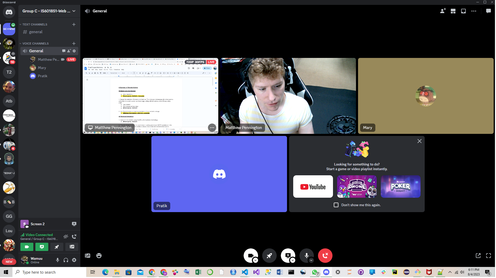

# Group Activity Report - Quality Assurance Review

During our meeting on 8/04/2023 and 8/6/2023, the three of us discussed some issues that need attention. Some needed resolving before submission while others were details that would enhance the website if implemented. We created issues for each in Github, talked about possible solutions, and assigned someone to be responsible for the issue.

Documentation of 5 such issues is as below:

1. Playwright tests passing locally but not as part of the workflow process on Github Actions.
    * [Issue #70](https://github.com/Mattpdrexel/group-project-is601-851-teamc-final/issues/70): Pratik could get the tests to pass on his local machine but not through the workflow testing. 
    * It times out instead. 
    *   We talked about possible causes and suspect there is some inconsistency in environment configurations. 
    *   We agreed to reconvene in 1-2 days if this still cannot be solved.
    * [Resolved with #69](https://github.com/Mattpdrexel/group-project-is601-851-teamc-final/pull/69).

2. Need margins on privacy policy page text
    * [Issue #65](https://github.com/Mattpdrexel/group-project-is601-851-teamc-final/issues/65): The privacy policy page currently has no left and right margins. 
    * We agreed we should add margins consistent with the other pages. 
    * [Closed with #72](https://github.com/Mattpdrexel/group-project-is601-851-teamc-final/pull/72)

3. Add footer to all pages
    * [Issue #64](https://github.com/Mattpdrexel/group-project-is601-851-teamc-final/issues/64): There currently is a footer only on the about us page. 
    * One of us will add the footer to the rest of the pages.
    * [Closed with #72](https://github.com/Mattpdrexel/group-project-is601-851-teamc-final/pull/72)

4. Need meta tags for sharing through social media
    * [Issue #66](https://github.com/Mattpdrexel/group-project-is601-851-teamc-final/issues/66): We found that we still need to implement what happens when a user discovers the site via a shared link. 
    * The issue is assigned to Matthew, with the rest of us reviewing it in 1-2 days.
    * [Closed with #73](https://github.com/Mattpdrexel/group-project-is601-851-teamc-final/pull/73)

5. Fix video loading issue
    * [Issue #71](https://github.com/Mattpdrexel/group-project-is601-851-teamc-final/issues/71): Video uploaded to github, but does not load properly in readme
    * Need to consider alternative way to host video to make more accessible
    * [Closed with #71](https://github.com/Mattpdrexel/group-project-is601-851-teamc-final/issues/71#issuecomment-1672355598)

NOTE: 
Issues also documented in the [project tab](https://github.com/users/Mattpdrexel/projects/1/views/1) with QA tab to identify each closed issue identifed during QA process.

## Meeting Attendance
All three members attended meetings. 

Meeting on 8/04/2023:

